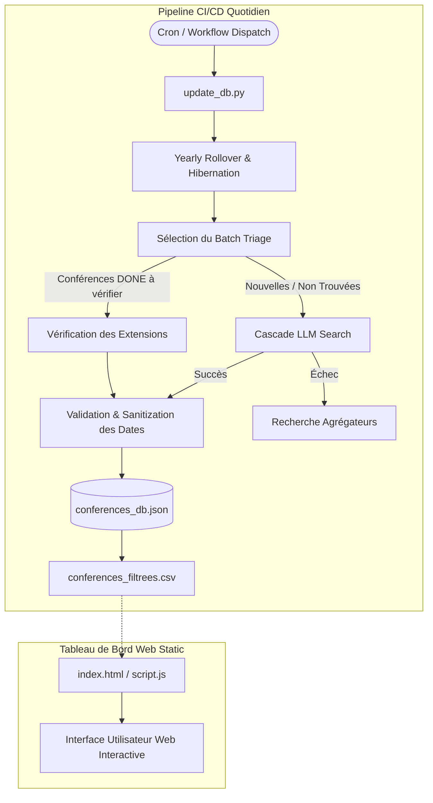

# ICORESearch - Autonomous Academic Conference Dashboard

[](LICENSE)
[](https://www.python.org/downloads/)
[](https://github.com/JohanPy/ICORESearch/actions/workflows/daily_update.yml)

**ICORESearch** est un tableau de bord web interactif couplé à un pipeline de données autonome (ETL) conçu pour automatiser la veille académique et le suivi des deadlines de conférences en informatique.

L'outil filtre les conférences académiques de la base **CORE**, effectue des recherches sur le Web via des modèles LLM avec recherche ancrée (Gemini avec Google Search Grounding) pour extraire automatiquement les dates de soumission, gère le roulement des éditions annuelles (Rollover) et surveille activement les extensions de délais (*Deadline Extensions*).

---

## 🚀 Fonctionnalités Clés

### 1. Tableau de bord Web Interactif (Frontend)
* **Filtrage Multicritères** : Recherche dynamique par Acronyme, Rangs CORE (ex: `A*`, `A`, `B`, `C`), Année et sélection de Thématiques de recherche.
* **Tri Dynamique** : Tri en un clic par dates de soumission, rangs ou acronymes.
* **Badges & Visualisation** : Rendu visuel clair avec statut des deadlines (dates à venir vs dépassées, alertes "Deadline Extended").
* **Édition Communautaire** : Bouton d'édition sur chaque ligne permettant aux utilisateurs de proposer des corrections directement sur GitHub.

### 2. Moteur d'Enrichissement Autonome (Pipeline `update_db.py`)
* **Extraction en Cascade (Phase 1 & 2)** :
  * *Phase 1 (Site Officiel)* : Recherche ancrée axée sur le domaine et le site officiel de l'édition visée.
  * *Phase 2 (Agrégateurs)* : Fallback sur les agrégateurs de référence (ex: WikiCFP, Researchr) si le site officiel n'est pas encore référencé.
* **Résolution Robuste d'URL** : Suivi des redirections d'API de recherche avec en-têtes HTTP pour capturer les vraies URL d'atterrissage.
* **Vérification Dynamique des Extensions** : Surveillance accrue à l'approche des dates limites pour détecter automatiquement les reports de soumission (*Firm Deadline / Extended*).
* **Gestion du Cycle de Vie (Rollover & Hibernation)** :
  * Lorsqu'une édition est terminée, le système passe automatiquement à la version suivante (`Target Year + 1`) et active une période d'hibernation (75 jours) pour préserver les quotas d'API.
* **Hygiène & Validation des Données** :
  * Validation stricte de la chronologie des dates (Abstract $\le$ Submission $\le$ Notification).
  * Vérification automatique de la plage d'années applicables (`[target_year - 1, target_year + 1]`).

---

## 🛠️ Architecture du Système



---

## 📦 Guide d'Installation & Utilisation Locale

### Prérequis
* Python 3.11 ou supérieur
* Une clé API Gemini ([Google AI Studio](https://aistudio.google.com/))

### 1. Cloner le Dépôt
```bash
git clone https://github.com/JohanPy/ICORESearch.git
cd ICORESearch
```

### 2. Installer les Dépendances
```bash
pip install -r requirements.txt
```

### 3. Configurer les Clés API
Vous pouvez spécifier votre clé via variable d'environnement ou fichier de configuration :

* **Option A (Variable d'environnement)** :
  ```bash
  export GEMINI_API_KEY="votre_cle_api_gemini"
  ```
* **Option B (Fichier YAML local)** :
  Copiez le modèle et renseignez votre clé dans `config.yaml` (fichier ignoré par Git) :
  ```bash
  cp config.example.yaml config.yaml
  ```

### 4. Démarrer l'Interface Web Locale
```bash
python3 -m http.server 8000
```
Ouvrez ensuite votre navigateur sur `http://localhost:8000`.

### 5. Exécuter le Script d'Enrichissement Manuellement
```bash
python3 update_db.py
```

---

## 💻 Structure du Projet

```text
ICORESearch/
├── .github/workflows/
│   └── daily_update.yml   # Workflow GitHub Actions d'exécution automatique
├── index.html              # Interface utilisateur web
├── styles.css              # Feuille de style CSS
├── script.js               # Parsing CSV, filtrage et rendu dynamique
├── update_db.py            # Script ETL autonome d'extraction et mise à jour
├── conferences_db.json     # Base de données JSON (source de vérité)
├── conferences_filtrees.csv# Export CSV lu par l'interface Web
├── CORE_all26.csv          # Dataset source des conférences CORE
├── config.example.yaml     # Modèle de configuration exemple
├── requirements.txt        # Dépendances Python
└── LICENSE                 # Licence MIT
```

---

## 🔧 Overrides Manuels (Intervention Humaine)

Si une conférence nécessite un ajustement manuel spécifique :
1. Éditez [conferences_db.json](file:///home/johan/Documents/IUT/codeOnGit/ICORESearch/conferences_db.json).
2. Réglez le champ `"manual_override": true` pour l'acronyme concerné.
3. Le pipeline `update_db.py` préservera vos modifications et ignorera les mises à jour automatiques pour cette entrée.

---

## 📄 Licence

Ce projet est distribué sous la licence libre **MIT**. Consultez le fichier [LICENSE](LICENSE) pour plus de détails.
