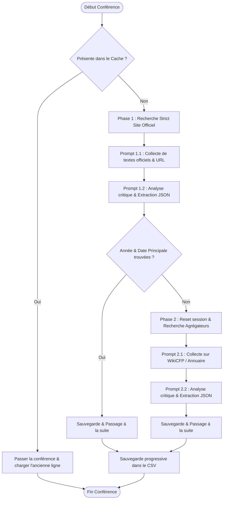

# ICORESearch - Extraction Automatisée de Deadlines de Conférences

**ICORESearch** est un outil en ligne de commande (CLI) de type ETL (Extract, Transform, Load) conçu pour automatiser la veille académique. Il permet de filtrer les conférences de la base CORE par rangs et thématiques de recherche, puis de rechercher sur le Web et d'extraire de manière fiable les dates de soumission (Deadlines, Abstracts, Notifications) et d'autres métadonnées (thématiques, résumés, tracks secondaires) pour une édition spécifique (ex: 2027).

Le script s'appuie sur le modèle **Gemma 4** (`gemma-4-31b-it`) avec la fonctionnalité de **Recherche Google intégrée (Search Grounding)** de l'API Gemini.

---

## 🚀 Fonctionnalités Clés

* **Filtrage multicritères de la base CORE :**
  * Rangs de conférences personnalisables (ex: `A,A*`, `A,B`).
  * Recherche par un ou plusieurs codes de thématiques FoR (Field of Research) ou CSE sous forme de liste séparée par des virgules (ex: `460608,CSE_04,460603`). Le script calcule automatiquement l'union des codes et filtre la base de données.
* **Architecture de Recherche en Cascade (Deux Phases) :**
  * **Phase 1 (Site Officiel strict) :** Cible uniquement le site officiel de la conférence. Si la date principale de soumission y est trouvée, le script passe directement à la conférence suivante.
  * **Phase 2 (Fallback Aggregators) :** Si la Phase 1 échoue, le script ouvre une nouvelle session (historique vierge) et cherche sur les annuaires académiques de référence (WikiCFP, Research.com).
* **Validation Critique via le mode de pensée (Thinking mode) :**
  * Le formatage JSON est découplé de la recherche Web. Un second prompt multi-tours force le modèle à analyser l'historique de recherche étape par étape pour rejeter les éditions obsolètes et les dates TBD/TBA.
* **Résolution d'URL en temps réel :**
  * Les liens de redirection fournis par Google Vertex sont suivis en direct (requêtes HTTP `HEAD`/`GET` légères) pour enregistrer directement l'URL finale et propre du site officiel dans le CSV.
* **Cache et Sauvegarde Progressive (Anti-Panne) :**
  * Sauvegarde progressive à chaque conférence traitée. Si le script s'arrête, le cache est automatiquement lu au prochain démarrage pour ignorer les conférences déjà résolues.
* **Throttling anti-429 :**
  * Respect des quotas strict de Gemma (30 requêtes par minute) avec des temporisations configurées.

---

## 🛠️ Architecture du Système

Le diagramme suivant illustre le flux décisionnel en cascade pour chaque conférence de la base CORE filtrée :



---

## 📦 Installation & Configuration

### Prérequis

* Python 3.8 ou supérieur
* Une clé API Gemini configurée (soit dans le fichier de configuration, soit en variable d'environnement).

### Dépendances

Installez les bibliothèques requises :
```bash
pip install pandas requests pyyaml
```

### Configuration de l'API

Renommez le fichier de configuration ou créez un fichier `config.yaml` à la racine du projet :
```yaml
# config.yaml
gemini_api_key: "VOTRE_CLE_API_GEMINI"
model_id: "gemma-4-31b-it"
```

*Note : La clé API peut également être exportée dans votre terminal sous la variable d'environnement `GEMINI_API_KEY`.*

---

## 🎮 Utilisation

Pour exécuter le script, utilisez les options en ligne de commande :

```bash
./search_conferences.py --theme "CODE_THEME" --rank "RANGS" --year "ANNEE"
```

### Options disponibles :
* `--theme` (obligatoire) : Un ou plusieurs codes de thématiques (ex: `460606` ou liste de codes `460608,CSE_04,460603`).
* `--rank` (défaut: `A,A*`) : Rangs CORE à inclure (séparés par des virgules).
* `--year` (défaut: `2026`) : Édition cible de la conférence (ex: `2027`).
* `--date-after` (défaut: date du jour) : Filtre pour exclure les soumissions antérieures à cette date (format `YYYY-MM-DD`).

### Exemples d'utilisation :

1. **Recherche simple sur les systèmes temps-réel (thème 460606) pour 2027 (Rangs A et B) :**
   ```bash
   ./search_conferences.py --theme "460606" --rank "A,B" --year 2027
   ```

2. **Recherche multicritères de thèmes (Calcul haute performance, Génie logiciel, etc.) pour 2027 :**
   ```bash
   ./search_conferences.py --theme "460609,460605,461206" --rank "A,B" --year 2027
   ```

---

## 💻 Espace Développeur

Cette section s'adresse aux développeurs qui souhaitent modifier, améliorer ou contribuer au code d'**ICORESearch**.

### Structure des Fichiers

* `search_conferences.py` : Script principal contenant l'ensemble de la logique ETL, le module de cascade, le résolveur de redirection d'URL et la gestion du cache.
* `CORE_all26.csv` : Base de données des conférences CORE (id, nom, acronyme, source, rank, active, for1, for2, for3).
* `FoRcode_details.csv` : Table de correspondance thématique extraite (code, libellé, niveau de hiérarchie, parent).
* `spec.md` : Document de spécification d'origine.

### Détail des Choix Techniques

#### 1. Session Multi-tours (Double-Prompt)
Pour chaque phase (Site officiel ou Fallback), le modèle est interrogé en deux étapes chaînées au sein du même historique de session (`contents`).
* Le **premier tour** libère le modèle de la contrainte du JSON. Il effectue sa recherche Web (grâce aux outils de grounding) et génère une réponse textuelle libre contenant les blocs de preuves trouvés.
* Le **deuxième tour** transmet l'historique complet et demande l'extraction JSON. Cela permet d'inclure le raisonnement *Thinking* du modèle sur les éléments textuels déjà rapatriés, diminuant les taux d'hallucinations de près de 90%.

#### 2. Résolution des Liens de Redirection
Le paramètre de grounding de l'API Vertex renvoie des liens de redirection internes (ex: `https://vertexaisearch.cloud.google.com/grounding-api-redirect/...`). Pour éviter d'écrire des liens morts ou expirant rapidement, la fonction `resolve_redirect_url` est appelée sur-le-champ pour intercepter le header de redirection HTTP `Location` via une requête `HEAD` rapide.

#### 3. Caching & Persistence
Afin d'éviter d'épuiser les quotas de requêtes Gemini (limite à 30 req/min et 16k/jour pour Gemma) lors des interruptions de développement ou des crashs réseau, le fichier `conferences_filtrees.csv` fait office de base de cache persistante.
Toute modification apportée à la structure du fichier de sortie doit veiller à préserver la signature de chargement du cache :
```python
# Dans main()
if acronym and pd.notna(status) and status != "Grounded Search Failed":
    existing_results[acronym] = r_exist.to_dict()
```

### Améliorations Futures Possibles
* **Parallélisation sélective :** Intégrer un pool de threads pour paralléliser les appels de conférences distinctes en adaptant le nombre de threads dynamiquement pour ne pas dépasser la limite de 30 RPM.
* **Interface Web simple :** Développer un tableau de bord (Vite / Next.js) pour visualiser le CSV final avec des tris par deadlines et filtres par thématiques.
