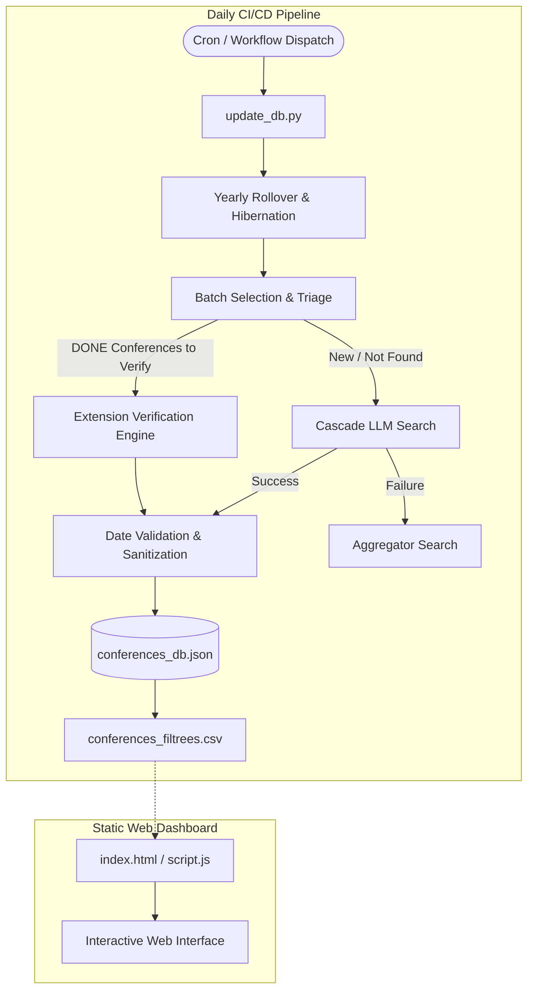

# ICORESearch - Autonomous Academic Conference Dashboard

[](LICENSE)
[](https://www.python.org/downloads/)
[](https://github.com/JohanPy/ICORESearch/actions/workflows/daily_update.yml)

**ICORESearch** is an interactive web dashboard coupled with an autonomous data pipeline (ETL) designed to automate monitoring and deadline tracking for Computer Science academic conferences.

The tool filters Computer Science conferences from the **CORE** ranking dataset, conducts web searches using grounded LLM models (Gemini with Google Search Grounding) to extract submission deadlines, handles yearly edition rollovers, and actively monitors deadline extensions.

---

## 🚀 Key Features

### 1. Interactive Web Dashboard (Frontend)
* **Multi-criteria Filtering**: Dynamic search by Acronym, CORE Ranks (e.g., `A*`, `A`, `B`, `C`), Target Year, and Research Subject Areas.
* **Dynamic Sorting**: One-click sorting by submission deadlines, rankings, or acronyms.
* **Badges & Visual Status**: Clear indicators for upcoming vs. passed deadlines and "Deadline Extended" alerts.
* **Community Contributions**: An edit button on every row allowing users to suggest corrections directly on GitHub via Pull Requests.

### 2. Autonomous Data Enrichment Pipeline (`update_db.py`)
* **Cascading Extraction (Phase 1 & Phase 2)**:
  * *Phase 1 (Official Website)*: Grounded search targeted at the domain and official site of the target edition.
  * *Phase 2 (Aggregators)*: Fallback search on trusted reference aggregators (e.g., WikiCFP, Researchr) if the official site is not yet listed.
* **Robust Redirect URL Resolution**: Resolves grounding search API redirect links with standard browser headers to capture canonical landing URLs.
* **Dynamic Verification Engine**: High-frequency monitoring as deadlines approach to automatically detect postponements (*Firm Deadline / Extended*).
* **Lifecycle Management (Rollover & Hibernation)**:
  * Automatically transitions completed editions to the next year (`Target Year + 1`) and hibernates entries (75 days) to conserve API quotas.
* **Data Hygiene & Validation**:
  * Enforces strict chronological order (Abstract $\le$ Submission $\le$ Notification).
  * Validates year boundaries (`[target_year - 1, target_year + 1]`).

---

## 🛠️ System Architecture



---

## 📦 Local Installation & Setup

### Prerequisites
* Python 3.11 or higher
* A Gemini API Key ([Google AI Studio](https://aistudio.google.com/))

### 1. Clone the Repository
```bash
git clone https://github.com/JohanPy/ICORESearch.git
cd ICORESearch
```

### 2. Install Dependencies
```bash
pip install -r requirements.txt
```

### 3. Configure API Credentials
You can provide your API key via an environment variable or a local configuration file:

* **Option A (Environment Variable)**:
  ```bash
  export GEMINI_API_KEY="your_gemini_api_key_here"
  ```
* **Option B (Local YAML File)**:
  Copy the template and fill in your key in `config.yaml` (ignored by Git):
  ```bash
  cp config.example.yaml config.yaml
  ```

### 4. Launch the Web Interface
```bash
python3 -m http.server 8000
```
Open your browser and navigate to `http://localhost:8000`.

### 5. Run the Data Pipeline Manually
```bash
python3 update_db.py
```

---

## 💻 Project Structure

```text
ICORESearch/
├── .github/workflows/
│   └── daily_update.yml   # GitHub Actions automated workflow
├── index.html              # Web user interface HTML
├── styles.css              # Styling rules
├── script.js               # CSV parsing, filtering, and table rendering
├── update_db.py            # Autonomous ETL enrichment script
├── conferences_db.json     # JSON database (Single Source of Truth)
├── conferences_filtrees.csv# Tabular CSV export read by the frontend
├── CORE_all26.csv          # Raw CORE dataset
├── config.example.yaml     # Configuration template
├── requirements.txt        # Python dependencies
└── LICENSE                 # MIT License
```

---

## 🔧 Manual Overrides

If a conference entry requires manual correction:
1. Edit [conferences_db.json](file:///home/johan/Documents/IUT/codeOnGit/ICORESearch/conferences_db.json).
2. Set `"manual_override": true` for the corresponding acronym.
3. The `update_db.py` pipeline will preserve your manual edits and skip automatic updates for that entry.

---

## 📄 License

Distributed under the open-source **MIT License**. See [LICENSE](LICENSE) for details.
